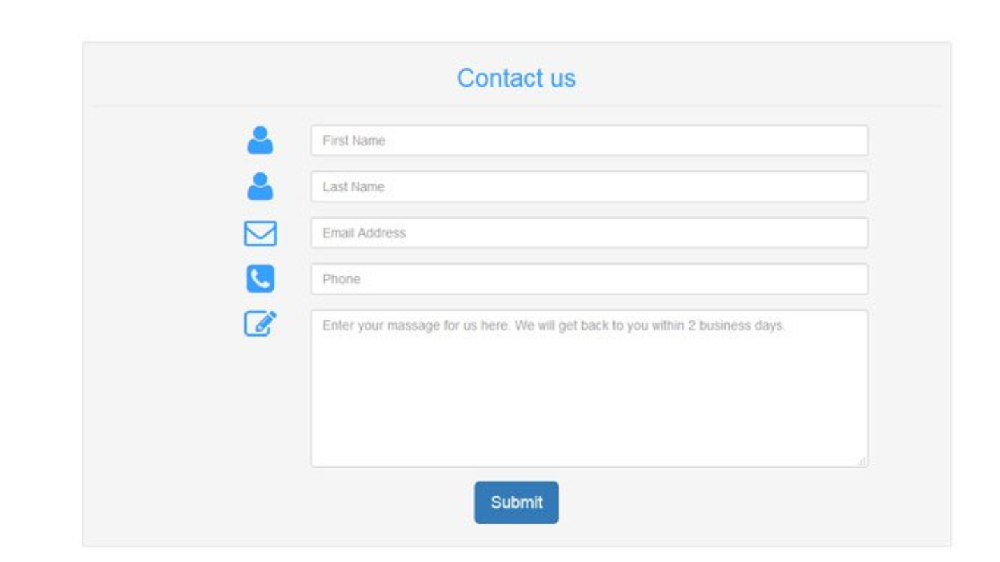
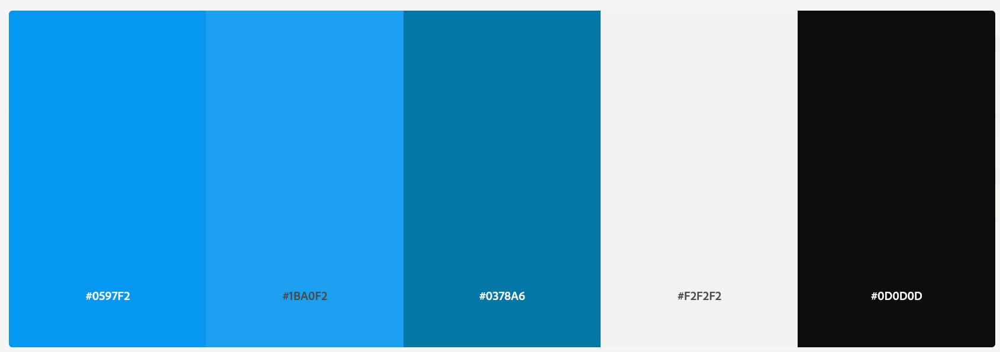

# Hojas de Estilo en Cascada CSS

El diseñador de contenidos nos ha entregado el siguiente Layaout para que lo maquetemos:

Con la siguiente carta de colores (Emplea el azul del extremo y el central):

Los iconos los puedes descargar desde aquí:

[Flaticon - Iconos](https://www.flaticon.com/packs/search?word=html)

Podemos descargar el proyecto de:

[URL GitHub](https://github.com/JJPS/HojasDeEstiloCSS)

Debes entregar en un fichero comprimido:

- Página HTML
- Hoja de estilos CSS
- Captura de pantalla del resultado

Suerte